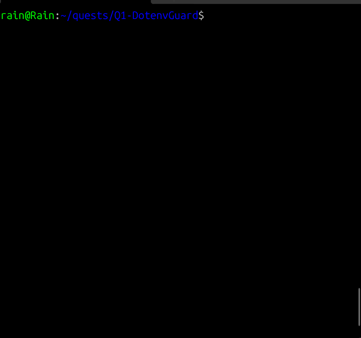

# dotenv-guard (Week 0 - Nano)

## Purpose
Compare .env.example (template) vs .env (local) and report MISSING / EXTRA (and DIFF in --strict).

## Usage (I/O spec only; no impl yet)
- Inputs: --example, --env; flags: --loose (default) | --strict, --format text|json, --dry-run
- Outputs: section in order MISSING → EXTRA → OK (→ DIFF if --strict), A→Z sorting
- Exit codes: 0=clean | 1=issues | 2=I/O error | 3=parse error (duplicate keys)

## Samples
See SPEC_IO.md §7

## Roadmap
Week 1: parser; Week 2: reporter; Week 3: CI and fixtures.

## Expected Output (loose mode)

Given:
- `.env.example` contains: APP_ENV, PORT, LOG_LEVEL, SECRET_KEY, DATABASE_URL
- `.env` contains: APP_ENV, PORT, LOG_LEVEL, SECRET_KEY, DEBUG_TOOLBAR

Expected:

MISSING
  DATABASE_URL
EXTRA
  DEBUG_TOOLBAR
OK
  APP_ENV
  PORT
  LOG_LEVEL
  SECRET_KEY

Notes:
- Sections are printed in order: MISSING, EXTRA, OK.
- Keys are sorted A→Z within each section.
- Exit code: 1 if there is any MISSING or EXTRA, otherwise 0.

## Makefile usage
- `make run` - run the script with default paths.
- `make test` - expects non-zero exit when `.env` is missing keys or has extras.
- `make test-ok` - expects zero exit when `.env.ok` contains all required keys (optional).

## Demo: docker compose up (short GIF)


```bash
docker compose up
# Ctrl+C to stop
docker compose down
```
